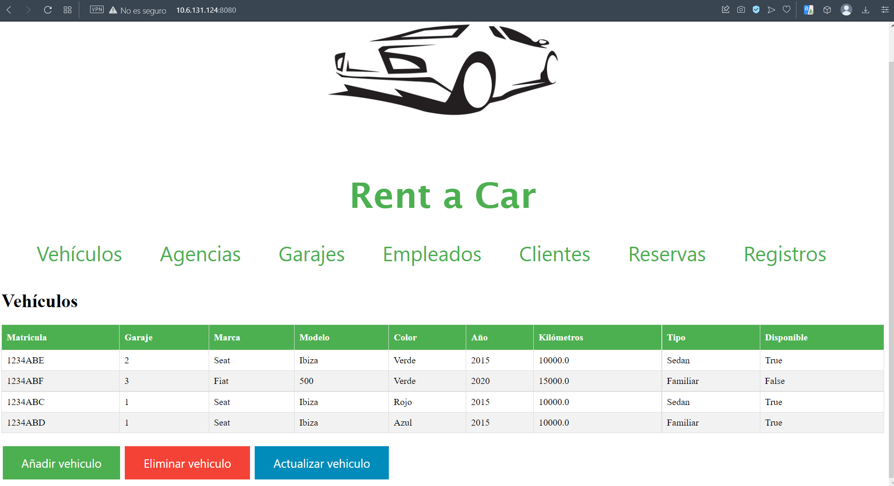

# Rent a Car
## Table of contents

- [Description](#description)
- [Installation](#installation)
- [Usage](#Usage)
- [Lincese](#lincense)
- [Authors](#authors)

---

## Description
This project consists of an application to manage the data of a car rental company.
You can manage the company's vehicles, agencies, garages, employees, reservations and clients.
An SQL database was implemented with the PostgresSQL database management system and a REST API was developed in Python with Flask.

To use the application you need to have the following installed:

- [PostgresSQL](https://www.postgresql.org/docs/)
- [Python](https://docs.python.org/3/)
- [Flask](https://flask.palletsprojects.com/en/2.2.x/)

In the next section, it will be explained in more detail.

---
## Installation
1. The first step is to clone the repository

```
$ git clone [link]
```
2. Check the version of Python you have on your computer, it must be equal to or greater than 3.8.
```
$ python3 --version
```
3. We are going to work in a virtual environment, this allows isolating a set of software packages and dependencies from other parts of the system. You can use the following command to install:
```
$ sudo apt install python3.8-venv
```
In the virtual environment that this project has, Flask is already installed and everything necessary to use it. However, it is necessary to have PostgrestSQL previously installed, the previous link redirects to the documentation for more information.

---
## Usage
We need to activate the virtual environment, we follow the following steps:

1. We move to the working directory. We execute the following command
```
$ . venv/bin/activate
```
or 

```
$ source venv/bin/activate
```
2. Now we execute the following command to start the Flask server

```
$ flask --app App_alquiler_coches run --host 0.0.0.0 --port=8080
```
3. Open the browser and type the following URL

```
http://localhost:8080
```

you should see something like this:




4. To exit the virtaul environment you must use the following command

```
$ deactivate
```
---
## Lincense


---

## Authors

Diego Díaz Fernández alu0101130026@ull.edu.es 

Fabrizzio Daniell Perilli Martín alu0101138589@ull.edu.es


---
